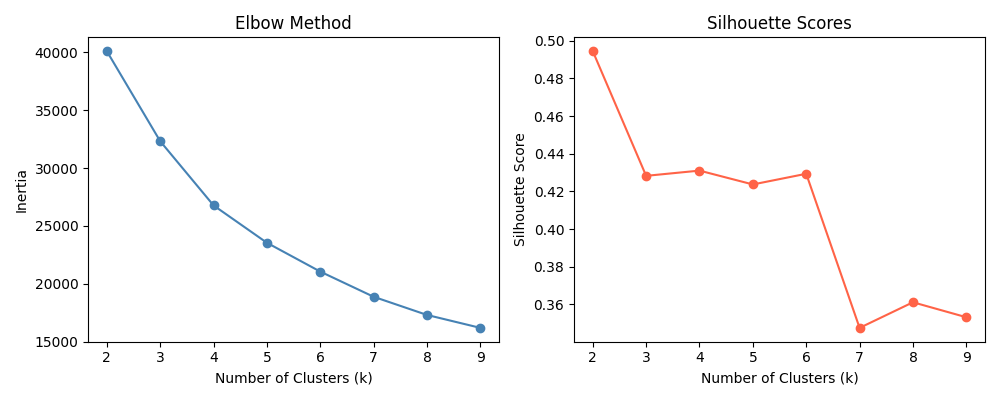
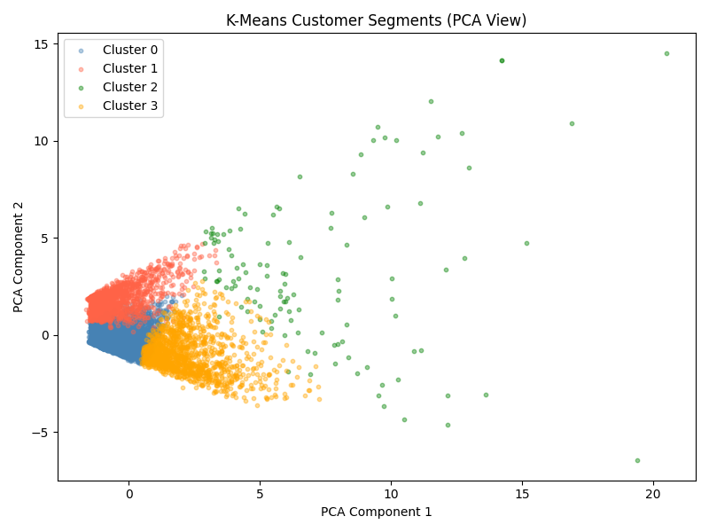
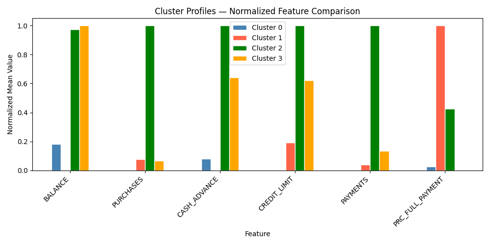
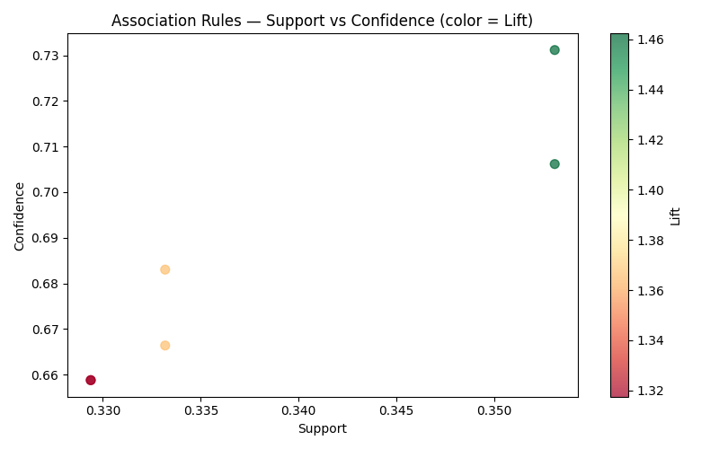

# Credit Card Customer Segmentation
## Technical Report — Data Mining Clustering Assignment
### Grand Canyon University
#### Ortasele Aisuan

---

## Problem Statement

Credit card companies manage thousands of customers with vastly different spending behaviors. Understanding these differences allows companies to personalize offers, manage risk, and improve customer retention. This project applies two data mining techniques — K-Means Clustering and Association Rules — to the Credit Card Dataset for Clustering to identify distinct customer segments and uncover behavioral patterns. The goal is to group 8,950 customers into meaningful segments and find associations between their financial behaviors.

---

## Part 1: Data Mining Techniques

### Clustering

Clustering is an unsupervised machine learning technique that groups data points together based on similarity without any predefined labels. The algorithm identifies natural groupings in the data by minimizing differences within groups and maximizing differences between groups. It is a first-step technique used to explore unknown structure in large datasets.

**Strengths:** Discovers hidden patterns without needing labeled data, works on large datasets, and provides actionable customer segments for business decisions.

**Weaknesses:** The number of clusters must be specified in advance for some methods, results can vary depending on initial conditions, and clusters can be difficult to interpret without domain knowledge.

**Real-world example:** Spotify uses clustering to group listeners by music taste and listening behavior, enabling personalized playlist recommendations for each segment (Raschka, Liu, & Mirjalili, 2022).

### Association

Association rule mining discovers relationships between variables in large datasets — specifically which items or behaviors tend to occur together. The Apriori algorithm finds frequent itemsets and generates rules of the form "if A then B" based on support, confidence, and lift metrics.

**Strengths:** Reveals non-obvious co-occurrence patterns, requires no labeled data, and produces human-readable if-then rules.

**Weaknesses:** Can generate a very large number of rules that require filtering, computationally expensive on large datasets, and sensitive to the support and confidence thresholds chosen.

**Real-world example:** Supermarkets use association rules to discover that customers who buy diapers also frequently buy beer, leading to strategic product placement decisions (Han, Kamber, & Pei, 2022).

### Correlation Analysis

Correlation analysis measures the statistical relationship between two numerical variables, quantifying how strongly and in what direction they move together. A correlation of +1 means they move perfectly together, -1 means they move perfectly opposite, and 0 means no relationship.

**Strengths:** Simple to compute and interpret, provides a clear numerical measure of relationship strength, and helps identify redundant features before modeling.

**Weaknesses:** Only measures linear relationships — two variables can have a strong non-linear relationship but a near-zero correlation coefficient. Also does not imply causation.

**Real-world example:** In finance, analysts compute the correlation between a stock's returns and a market index to measure how much the stock moves with the overall market — known as beta (Han, Kamber, & Pei, 2022).

---

## Algorithm of the Solution

**K-Means Pipeline:**
1. Load dataset and drop the customer ID column
2. Fill missing values using median imputation
3. Select 6 key behavioral features
4. Standardize features using StandardScaler
5. Use Elbow Method and Silhouette scores to find optimal k
6. Train final K-Means model with k=4
7. Visualize clusters using PCA dimensionality reduction

**Association Rules Pipeline:**
1. Bin continuous features into binary categories using median thresholds
2. Mine frequent itemsets using Apriori with minimum support of 0.3
3. Generate association rules filtered by lift >= 1.2
4. Visualize rules by support, confidence, and lift

---

## 1. Load and Preprocess Data

```python
df = pd.read_csv('CC GENERAL.csv')
df = df.drop(columns=['CUST_ID'])

df['CREDIT_LIMIT']     = df['CREDIT_LIMIT'].fillna(df['CREDIT_LIMIT'].median())
df['MINIMUM_PAYMENTS'] = df['MINIMUM_PAYMENTS'].fillna(df['MINIMUM_PAYMENTS'].median())

features = ['BALANCE', 'PURCHASES', 'CASH_ADVANCE',
            'CREDIT_LIMIT', 'PAYMENTS', 'PRC_FULL_PAYMENT']

scaler = StandardScaler()
X_std  = scaler.fit_transform(X)
```

**Output:**
```
Dataset shape    : (8950, 17)
Missing values   : 314
After cleaning   : 0 missing values
```

The dataset contains 8,950 credit card customers with 17 behavioral features. Only 314 values were missing across two columns — CREDIT_LIMIT and MINIMUM_PAYMENTS — filled using median imputation to avoid skewing from outliers. Six key features were selected covering balance, spending, cash advance usage, credit limit, payments, and full payment rate.

---

## 2. Finding Optimal Clusters — Elbow Method

```python
for k in range(2, 10):
    km = KMeans(n_clusters=k, random_state=42, n_init=10)
    km.fit(X_std)
    inertia.append(km.inertia_)
    sil_scores.append(silhouette_score(X_std, km.labels_))
```

**Output:**
```
k=2  inertia=40107  silhouette=0.495
k=3  inertia=32326  silhouette=0.428
k=4  inertia=26778  silhouette=0.431
k=5  inertia=23548  silhouette=0.424
```



The elbow curve shows diminishing returns in inertia reduction after k=4. The silhouette score peaks at k=2 but k=4 provides more meaningful business segments while maintaining a reasonable silhouette score of 0.431. Four clusters was selected as the optimal choice.

---

## 3. K-Means Clustering Results

```python
km_final = KMeans(n_clusters=4, random_state=42, n_init=10)
km_final.fit(X_std)
df['Cluster'] = km_final.labels_
```

**Output:**
```
Cluster 0 : 5992 customers (66.9%)
Cluster 1 : 1371 customers (15.3%)
Cluster 2 :  123 customers  (1.4%)
Cluster 3 : 1464 customers (16.4%)

Cluster Profiles:
         BALANCE  PURCHASES  CASH_ADVANCE  CREDIT_LIMIT  PAYMENTS  PRC_FULL_PAYMENT
Cluster 0  1013      614          514          3146        1006          0.04
Cluster 1   151     1448          116          4938        1725          0.77
Cluster 2  4747    11286         5140         12464       18319          0.34
Cluster 3  4878     1314         3342          8928        3325          0.02
```





**Cluster Interpretation:**
- **Cluster 0 — Average Users (66.9%):** Moderate balance, moderate purchases, low full payment rate. The majority of customers — typical everyday credit card users.
- **Cluster 1 — Responsible Spenders (15.3%):** Low balance, high purchases, very high full payment rate (77%). These customers spend actively but pay off balances regularly — low risk, high value.
- **Cluster 2 — High Value (1.4%):** Extremely high balance, purchases, cash advances, and payments. Big spenders with high credit limits — the bank's most valuable but also highest-risk segment.
- **Cluster 3 — Cash Advance Users (16.4%):** High balance, low purchases, very high cash advance usage, near-zero full payment rate. These customers rely heavily on cash advances and rarely pay in full — highest risk segment.

---

## 4. Association Rules Results

```python
df_bool        = df_assoc.astype(bool)
frequent_items = apriori(df_bool, min_support=0.3, use_colnames=True)
rules          = association_rules(frequent_items, metric='lift', min_threshold=1.2)
```

**Output:**
```
Frequent itemsets found : 8
Association rules found : 6

Top rules by lift:
Antecedent       Consequent        Support  Confidence  Lift
High_CashAdv  →  High_Balance      0.353      0.731    1.462
High_Balance  →  High_CashAdv      0.353      0.706    1.462
High_CreditLim → High_Payments     0.333      0.683    1.366
High_Purchases → High_Payments     0.329      0.659    1.318
```



The strongest association found is between high cash advance usage and high balance — customers who take large cash advances are 1.46 times more likely to carry a high balance than random chance would predict. This directly supports the Cluster 3 finding. High credit limit customers are also strongly associated with high payments, confirming that credit limit is a reasonable proxy for financial capacity.

---

## Analysis of Findings

The K-Means model successfully identified four distinct customer segments with a silhouette score of 0.431. The largest segment — 67% of customers — are average everyday users. The most actionable finding is the cash advance segment (Cluster 3, 16.4%), where customers carry high balances, make minimal purchases, and almost never pay in full. This segment represents the highest default risk and should be flagged for proactive outreach or credit limit review.

The association rules confirmed and extended the cluster findings. The strong association between cash advance behavior and high balance (lift 1.462) validates that these behaviors co-occur at a rate significantly above chance. The association between high credit limits and high payments (lift 1.366) suggests that customers with higher limits tend to be more financially active overall.

Together K-Means and association rules provide complementary insights — clustering identifies who the customer segments are while association rules explain what behaviors tend to occur together within and across those segments (Han, Kamber, & Pei, 2022).

---

## References

Han, J., Kamber, M., & Pei, J. (2022). *Data mining: Concepts and
    techniques* (4th ed.). Morgan Kaufmann.

Raschka, S., Liu, Y., & Mirjalili, V. (2022). *Machine learning with
    PyTorch and Scikit-Learn* (3rd ed.). Packt. ISBN 9781801819312.

Pedregosa, F., Varoquaux, G., Gramfort, A., et al. (2011). Scikit-learn:
    Machine learning in Python. *Journal of Machine Learning Research*,
    12, 2825–2830.